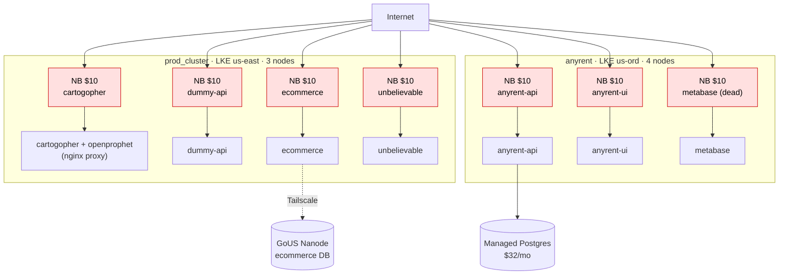
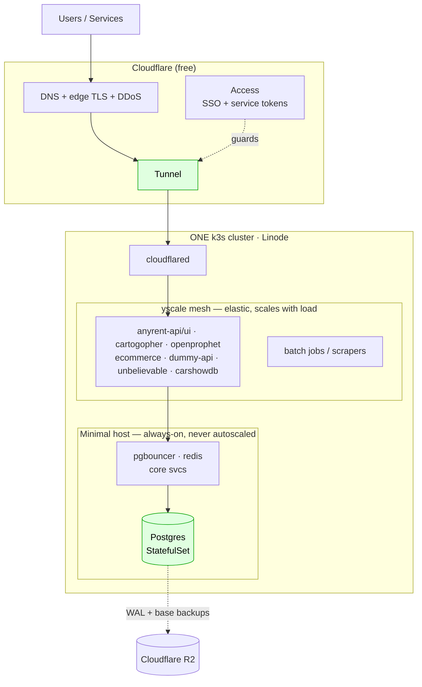
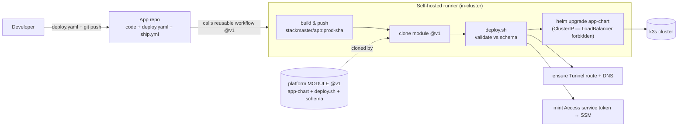

# Diagrams — current vs target, and the deploy module

Mermaid (renders on GitHub / most markdown editors). ASCII versions of #2 and #3 are in the chat.

## 1. BEFORE — today (~$235/mo): 2 clusters, 7 NodeBalancers, managed Postgres

## 2. AFTER — target (~$50–72/mo recurring): 1 k3s cluster, Cloudflare Tunnel, self-hosted PG

## 3. The deploy module — submit a YAML → runner clones module → deploys

