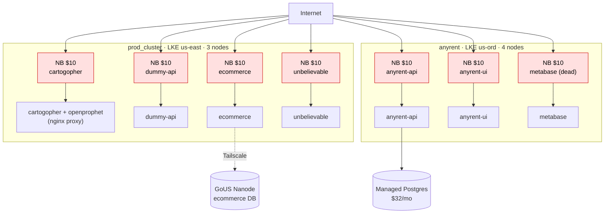
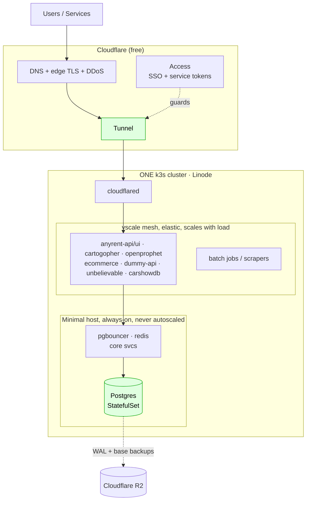
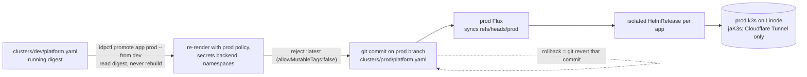

# Diagrams: cost-model history, and the current deploy flow

Mermaid (renders on GitHub and most markdown editors).

Diagrams #1 and #2 are historical cost-model context: the Linode bill that motivated the move to one self-hosted cluster. They are kept for the "why" and do not describe the current control plane. Diagram #3 is the current, authoritative deploy flow.

## 1. Historical cost model, BEFORE (about $235/mo): 2 clusters, 7 NodeBalancers, managed Postgres

Historical context only. This is the spend the platform replaced, not the current topology.



## 2. Historical cost model, target (about $50 to $72/mo recurring): 1 k3s cluster, Cloudflare Tunnel, self-hosted PG

Historical context only. This sketches the target topology the move aimed at: one cluster, no per-app NodeBalancer, Cloudflare Tunnel for public exposure, self-hosted Postgres. The current prod cluster is the self-provisioned k3s on Linode (the jaK3s golden image), and the live deploy mechanics are in diagram #3.



## 3. The current deploy flow: shopping list in, Flux reconciles a per-app HelmRelease

The per-app `deploy.yaml` shopping list is the product. A developer declares a small app contract (app, runtime, routes, sizing, db, cache, volumes, connectsTo, ...) and the platform derives all Kubernetes from it: namespaces, a Deployment, a ClusterIP Service, secret refs, env vars (DATABASE_URL, REDIS_URL, ...), probes, resource limits, autoscaling, and observability. The developer never writes a Deployment, a Service, or (by policy) a LoadBalancer.

Deploying is a git commit, and Flux is the only writer. `idpctl render` upserts the app into `clusters/<env>/platform.yaml`, the one umbrella HelmRelease whose values list every app. `charts/cluster` templates one isolated HelmRelease per app plus its dedicated stores and each enabled module. Nothing runs `kubectl apply` or `helm upgrade`; `disableWait` isolates a failing app so it cannot wedge its siblings.

### Dev: continuous and automatic via the in-cluster idp-shipper

In dev the loop is automatic. `idp-shipper` (`cmd/idp-shipper`) is infra-owned, in-cluster, and dev-only (`registry.env: dev`). It realizes "push to your branch, it deploys." Per registered app, every interval it reads the GitHub head SHA for the app's repo and branch; if the SHA changed it derives the build set from the shopping lists (dedup by image), builds only the images whose inputs (`build.context`/`dockerfile`/`submodules`) changed via the in-cluster `image-builder` (rootless BuildKit publishing to GHCR, tag `<image>:<short-sha>`), reuses the tag already pinned in the umbrella for unchanged images, renders each component into `clusters/dev/platform.yaml` using idpctl's render core, then commits and pushes the platform branch so Flux reconciles. The developer only ever touches their `deploy.yaml`.

The shipper registry (which apps to ship: repo, branch, deploy.yaml paths) is infra-owned config (a ConfigMap) declared in `environments/dev/cluster.yaml` and applied via `idpctl infra render`.

```mermaid
flowchart LR
  DEV["Developer"] -->|"edit deploy.yaml<br/>git push branch"| APP["App repo<br/>code + deploy.yaml"]
  subgraph CTRL["in-cluster control plane (dev)"]
    direction TB
    SHIP["idp-shipper<br/>poll head SHA per app"]
    BLD["image-builder<br/>rootless BuildKit -> GHCR<br/>tag image:short-sha"]
    REN["idpctl render core<br/>upsert into umbrella"]
    SHIP -->|"SHA changed:<br/>build only changed inputs"| BLD
    BLD --> REN
  end
  APP -->|"head SHA"| SHIP
  REN -->|"git commit + push<br/>clusters/dev/platform.yaml"| BR["platform branch (main)"]
  BR --> FLUX["Flux Operator +<br/>umbrella HelmRelease"]
  FLUX -->|"reconciles charts/cluster"| HR["isolated HelmRelease<br/>per app (+ stores, modules)"]
  HR --> CLU[("dev k3s cluster")]
```



Manual dev deploy, for a new or unregistered app, or from the cockpit:

```bash
idpctl render --env dev --root <idp clone> -f deploy.yaml --image <ref>
# then commit + push clusters/dev/platform.yaml to main; Flux reconciles
```

### Prod: deliberate and digest-forward

Prod promotes from dev directly. Stage is deferred: `environments/prod/cluster.yaml` declares `promotion.from: dev` (comment: "stage is deferred for now, promote dev -> prod directly").

`idpctl promote <app> prod --from dev -f deploy.yaml` reads the image digest already running in dev's umbrella and re-renders the app into `clusters/prod/platform.yaml` with prod's policy, secrets backend, and namespaces. It never rebuilds the artifact. Prod refuses mutable tags: `allowMutableTags: false`, and prod is hard-rejected in code regardless. Prod's `flux.branch` is `prod` and the prod cluster syncs `refs/heads/prod`, so you commit the promote on the prod branch (the command prints the branch). Rollback is a `git revert` of that one commit.



The prod cluster is self-provisioned k3s on Linode (the jaK3s golden image: hardened Debian plus Cilium plus embedded etcd plus kube-vip; etcd snapshots ship to R2). Prod exposure is Cloudflare Tunnel only (no MetalLB), `statefulStores: false`, so apps get `DATABASE_URL` from the secrets backend and stay PVC-free by contract. Stage is scaffolded in-repo but deferred, not in the active promotion path; the live path today is dev to prod.
