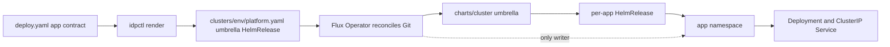
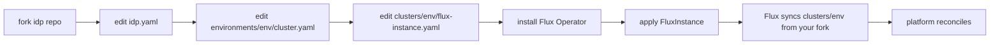
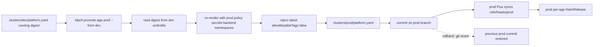
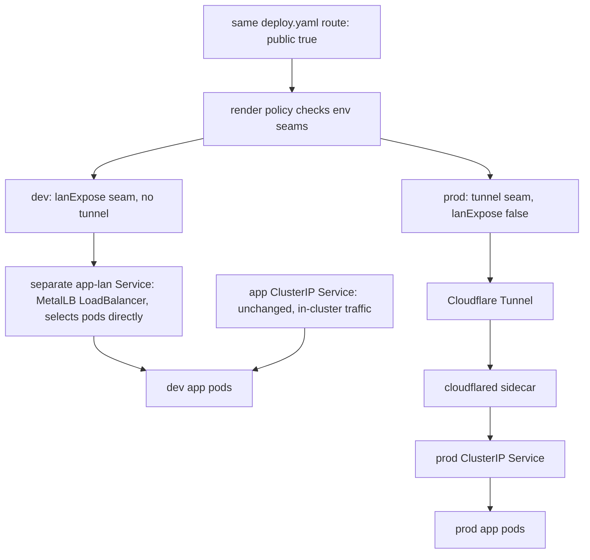
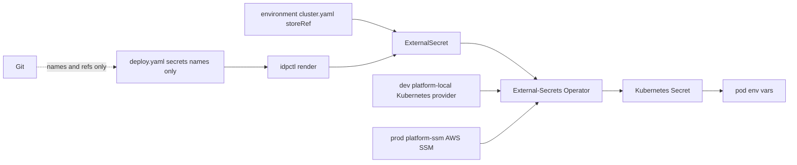
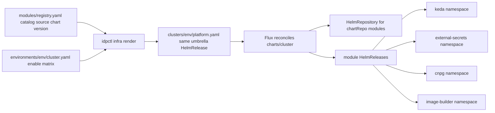

# Diagrams: Yscale IDP visual guide

Mermaid diagrams for the reference platform. These are plain GitHub-renderable `flowchart` diagrams.

## 1. The platform at a glance

The per-app `deploy.yaml` is the app contract; it declares what the app needs, not Kubernetes objects. `idpctl render` upserts that contract into `clusters/<env>/platform.yaml`, the one umbrella `HelmRelease` for the environment. Flux is the only writer: it reconciles the umbrella, `charts/cluster` fans it out into a per-app `HelmRelease`, and that release creates the app namespace. The reference shape keeps app services ClusterIP by default, with exposure, data stores, and secrets supplied by environment seams.

## 2. Fork model / bringup

The platform is meant to be forked, not installed as a black-box service. Fork the repo, edit `idp.yaml`, edit `environments/<env>/cluster.yaml`, and edit `clusters/<env>/flux-instance.yaml` so both the env config and Flux sync point at your fork. Then install the Flux Operator and apply the `FluxInstance`; from that point, Flux reconciles the platform state from your fork. App delivery stays the same: a `deploy.yaml` render changes the umbrella, and a Git commit is the deploy.

## 3. Dev -> prod promotion

Production promotion is digest-forward. `idpctl promote <app> prod --from dev` reads the image digest already running in dev's umbrella and re-renders the same artifact under prod policy, prod namespaces, and the prod secrets backend. It never rebuilds the artifact; prod rejects mutable tags with `allowMutableTags: false` and the hard `:latest` guard. Commit the resulting `clusters/prod/platform.yaml` on the `prod` branch so prod Flux applies it; rollback is `git revert` of that commit.

## 4. One route, two fulfillments (the seams)

A `deploy.yaml` route with `public: true` means "expose this to users"; the target environment decides how. In dev, the reference env has no tunnel path and fulfills the route through the `lanExpose` seam: the chart renders a SEPARATE `<app>-lan` MetalLB `LoadBalancer` Service that selects the pods directly, while the app's own ClusterIP Service stays unchanged for in-cluster traffic (`charts/app/templates/lan-service.yaml` — the one sanctioned LoadBalancer). In prod, the env declares the tunnel seam and disables `lanExpose`, so Cloudflare Tunnel is the ingress path and apps stay ClusterIP, never a `LoadBalancer`.

## 5. Secrets flow

`deploy.yaml` declares secret names only; secret values do not belong in Git. The renderer emits an `ExternalSecret` that references the target environment's store: dev uses the `platform-local` Kubernetes-provider store, while prod uses the `platform-ssm` AWS SSM store. External-Secrets Operator reads that store and materializes a Kubernetes `Secret` in the app namespace. The app chart then injects the secret data as environment variables.

## 6. Module system

`modules/registry.yaml` is the catalog: each module records its source, chart, version, default namespace, and purpose. `environments/<env>/cluster.yaml` is the enable matrix and per-env override file. `idpctl infra render` sets the enabled modules into the same umbrella `HelmRelease` used for apps, then `charts/cluster` templates module `HelmRelease` entries and any needed `HelmRepository` objects. Flux installs the enabled infra into its namespace, such as KEDA, External-Secrets Operator, CloudNativePG, image-builder, or idp-shipper.

